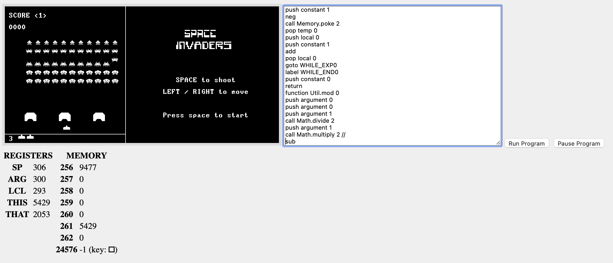

# JackVM Player

This repository contains the source for a Jack language Virtual Machine that runs on the web.  The Jack language is a high-level language you build as part of [nand2tetris](https://www.nand2tetris.org) (aka The Elements of Computing Systems).

Previously, Jack programs only run for those who've installed the nand2tetris software suite on their desktops. This project aims to allow people to share their work more easily on the web.

[Demo Site](https://jcon.github.com/jackvm-rs)

Rough Demo of JackVM Player:




## Running via the Webpack Dev Server

The easiest way to test this project locally is to run the demo site. To run demo site locally, you'll need the following installed: `rustup`, `rustc`, `cargo` and `npm`. If you don't have rust installed, follow [these instructions](https://www.rust-lang.org/tools/install). The [npm site](https://www.npmjs.com/get-npm) has instructions for installing NPM.

```sh
> cd demo
> npm install
> npm run start
```

Webpack will print out the port it's serving the site on (usually 8080, or the next available port after that). Your web browser will automatically load the JackVM Player with a simple single-player pong game.

## Running tests

This project aims to have decent coverage, particularly of its compiler and virtual machine. Tests can be run via cargo:

```sh
> cargo test
```

## Running other JackVM Programs

The JackVM Player currently only runs Jack language "VM" files (`*.vm`). For now, you can convert any Jack language program into a series of `.vm` files using the nand2tetris software suite:

```sh
> cd projects/11/Pong
> ../../../tools/JackCompiler.sh .
> cat *.vm > pong_complete.vm

# alternatively, on MacOS:
> cat *.vm | pbcopy
```

Then paste the contents of pong_complete.vm into the demo field and click "run".

## Installing on your own website

You can install the player on your own site. The [NPM package](http://npmjs.com/package/jackvm-player) published by the [web](./web) crate explains how to do this web with webpack.

## Author

Jim Connell 2021
