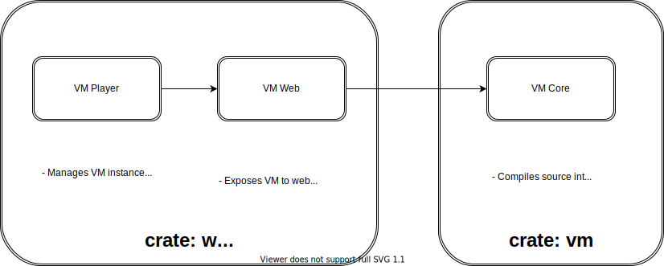

# Architecture

The JackVM is broken into two crates:
- `vm` contains the core logic for compiling & executing VM programs in a platform indepdent manner.
- `web` provides an IO bridge between `vm` and the web via a Web Assembly application.

At a high-level, the Jack VM is composed of three main modules across these two crates:
- JackVmPlayer, web-facing player that handles callbacks.
- The JackVmWeb, converts web events into VM updates and VM updates into screen updates.
- The core VM: handles program compilation and execution.

## The VM Crate

The VM crate provides the following services:
- Compilation of plain-text VM source files into a format that can easily be executed.
- An platform-independent execution engine for compiled VM programs. The JackVM updates a certain region of its memory for screen updates & reads another location for keyboard events.

## The Web Crate

The web crate is a [wasm-pack](https://github.com/rustwasm/wasm-pack) crate that builds the `jackvm-player` npm module.

There are two main modules: the `lib` module and the `web_vm` module. The `lib` module defines `JackVmPlayer`, which is the public interface exposed to the web. Its primary purpose is to allow sharing of `vm_web` between various callbacks.

The `web_vm` module does the majority of work handling IO to and from a core VM instance. It reads data from the VM's screen memory map location to draw pixels on a canvas. It converts keydown events into updates in the VM's keyboard memory map location.
